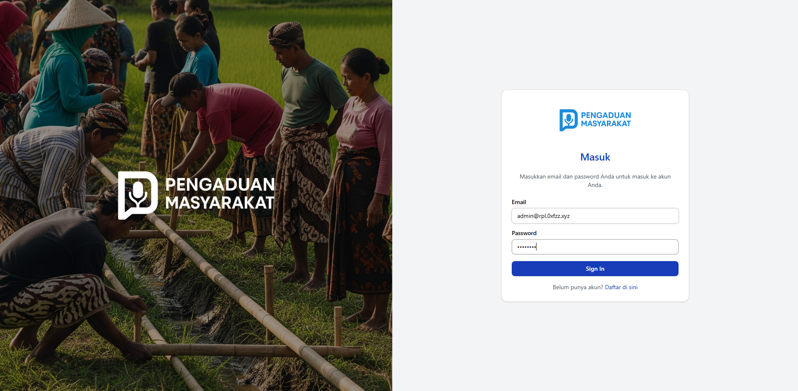
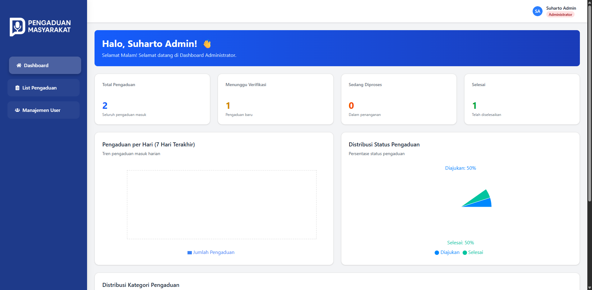

# Pengaduan Masyarakat Web App

 I'm going to be honest here :) , so I actually just doing an experiment to demonstrate that I can make a web app using AI entirely. So this web app was made using Github Copilot (Claude Sonnet 4 and GPT). I was actually shocked by how this web app turned out. It's shockingly scary, that if I had recreated it 4 years ago, it might have taken 1 week. 

 In this Web App all the code was just Github Copilot and I just made the prompts to work with my plan. So what's my job in this web app? I was just fixing the bugs that the AI made and making minor changes. Still it has to be acknowledged that this is a collaborative effort between human and AI.

 All GPT aside, this is a Pengaduan Masyarakat App where masyarakat can report whatever they can report to the goverment that used this app.
 This app has several features such as user authentication, role-based access control, and a dashboard for viewing reports.

 I deployed this app using Supabase for the database and Vercel for hosting the web app.

 https://rpl-pengaduan-masyarakat.vercel.app

 Here is the screenshot of the web app:




 # Setup
 ```
npm install
npx prisma generate --schema src/prisma/prisma.schema
 ```
Add your environment values just like the .env.example. Then, run this script below.
```
npx prisma migrate
npm run dev
```